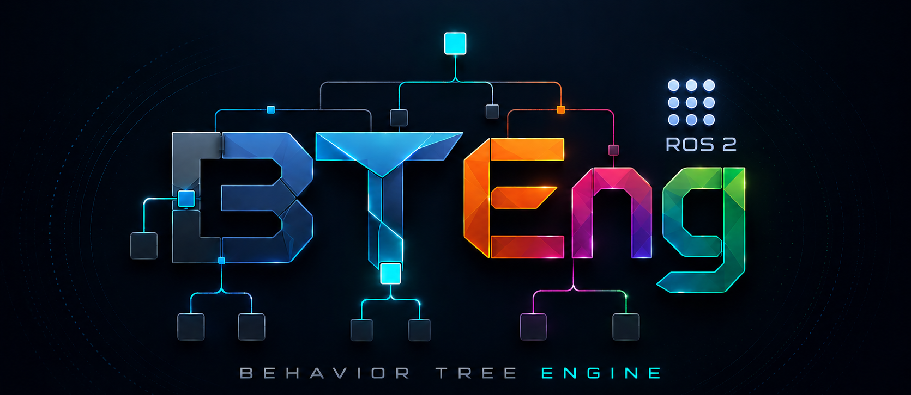

<p align="center">
  
</p>

# bteng-ros2

[](https://www.python.org/)
[](LICENSE)
[](pyproject.toml)
[](https://pypi.org/project/bteng/)

ROS 2 base classes for the [BTEng](https://pypi.org/project/bteng/) behavior tree engine.

A pure Python pip library. No ROS 2 workspace or colcon required.

## Install

```bash
source /opt/ros/humble/setup.bash   # or iron / jazzy
pip install bteng-ros2
```

`bteng` is pulled in automatically. **`bteng>=0.3.1` is required** — this
package's nodes rely on fixes landed in that release (`execute_tick()` rejecting
a non-`NodeStatus` result, `ParallelNode` validating without an explicit
`success_threshold`, reactive guards re-ticking). Older cores are not supported.

### Importing without ROS 2

`import bteng_ros2` succeeds on a machine with **no rclpy installed**, so a CLI
can serve `--help` / `--dry-run` and a test suite can run off-robot:

| Without rclpy | Works? |
|---|---|
| `import bteng_ros2`, `bteng_ros2.__version__` | yes |
| Defining node classes: `RosActionNode`, `RosServiceNode`, `RosConditionNode`, `RosStatefulActionNode`, the four mixins | yes |
| Constructing and ticking them against `FakeRosNode` | yes |
| Building and validating a `Tree` of them | yes |
| Subclassing `RosBTExecutor` / `LifecycleBTExecutor` | yes |
| **Constructing** `RosBTExecutor` / `LifecycleBTExecutor` | **no** — raises `ImportError` naming the missing rclpy symbol |
| Any call that reaches real ROS traffic (`create_publisher` on a real node, `_init_action_client`, …) | no |

The two executors are real rclpy nodes, so they cannot work without ROS; they
fail loudly at construction rather than half-working. Check
`bteng_ros2.executor.RCLPY_AVAILABLE` if your program needs to branch.

## Design

`bteng-ros2` provides **mixins and base classes** — not a standalone node.
Users inherit from them inside their own ROS 2 packages.

```
Mixins (combine freely)         Pre-combined bases (common patterns)
─────────────────────────       ───────────────────────────────────
RosNodeMixin                    RosActionNode
RosActionClientMixin            RosStatefulActionNode
RosServiceClientMixin           RosConditionNode
RosTopicMixin
```

## Usage

### Simple action node

```python
from bteng_ros2 import RosActionNode
from nav2_msgs.action import NavigateToPose

class Navigate(RosActionNode):
    action_type = NavigateToPose
    action_name = "/navigate_to_pose"

    def make_goal(self):
        goal = NavigateToPose.Goal()
        goal.pose = self.blackboard.get("target_pose")
        return goal

    def on_success(self):
        self.blackboard.set("arrived", True)
```

### Stateful node with multiple ROS capabilities

```python
from bteng_ros2 import RosStatefulActionNode
from nav2_msgs.action import NavigateToPose
from std_msgs.msg import String

class NavigateAndPublish(RosStatefulActionNode):
    def on_start(self):
        self._pub = self.create_publisher(String, "/status", 10)
        self._init_action_client(NavigateToPose, "/navigate_to_pose")
        self.send_goal(self._build_goal())

    def on_running(self):
        self._pub.publish(String(data="navigating"))
        return self.action_status()

    def on_halted(self):
        self.cancel_goal()
```

### Mix freely — combine only what you need

```python
from bteng import StatefulActionNode, NodeStatus
from bteng_ros2 import RosActionClientMixin, RosTopicMixin

# Only action + topic, no service client overhead
class Navigate(RosActionClientMixin, RosTopicMixin, StatefulActionNode):
    ...
```

### Condition from a topic

```python
from bteng_ros2 import RosConditionNode
from sensor_msgs.msg import LaserScan

class ObstacleDetected(RosConditionNode):
    topic_type = LaserScan
    topic_name = "/scan"

    def evaluate(self, msg: LaserScan) -> bool:
        return min(msg.ranges) < 0.5
```

### Wire into your ROS 2 node

```python
import rclpy
from bteng import SequenceNode, Tree, TreeMetadata, ExecutorConfig
from bteng_ros2 import RosBTExecutor

rclpy.init()

nav   = Navigate("nav")        # no ros_node needed at construction
check = ObstacleDetected("obs")
root  = SequenceNode("root", children=[check, nav])
tree  = Tree(TreeMetadata(id="robot"), root)

bt = RosBTExecutor(tree, ExecutorConfig(tick_interval=0.05))
# ↑ injects itself into nav and check automatically

status = bt.run(timeout=60.0)   # spins until the tree settles, then returns
bt.destroy_node()
rclpy.shutdown()
```

`run()` is the one-tree-then-exit form: it spins, returns the root's final
`NodeStatus`, and on timeout halts the tree and returns `FAILURE`. For a
long-lived node that keeps serving after the tree finishes, use `rclpy.spin(bt)`
instead. Pass `ros_node=` to have the tree share an rclpy node you already own
rather than the executor itself.

### Lifecycle variant

```python
from bteng_ros2 import LifecycleBTExecutor

class RobotBT(LifecycleBTExecutor):
    def build_tree(self) -> Tree:
        return Tree(TreeMetadata(id="robot"), ...)
```

Import from `bteng_ros2.lifecycle`:
```python
from bteng_ros2.lifecycle import LifecycleBTExecutor
```

### Testing without ROS 2

```python
from bteng_ros2.testing import FakeRosNode

fake = FakeRosNode()
node = Navigate("nav", ros_node=fake)

# Inject a fake message into a subscription
fake.subscriptions["/scan"].inject(LaserScan(ranges=[1.0, 2.0]))

# Service clients: control readiness and when the response lands
fake = FakeRosNode(service_deferred=True)      # responses wait for resolve()
node = SetParam("svc", ros_node=fake)
node.on_start()                                 # RUNNING — call in flight
fake.service_clients["/set_param"].resolve(response)
```

See [docs/testing.md](docs/testing.md).

## License

Apache 2.0
